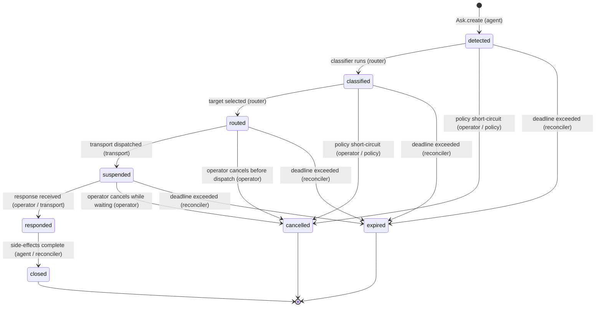

# mt#1528 — Inbox Data Model + Lifecycle Diagram

**Status:** Research brief — no schema changes or migrations in this document.

**Parent:** mt#454 (full inbox research)  
**Siblings:** mt#1526 (ecosystem comparison), mt#1529 (CLI UX), mt#1531 (mt#327 integration)  
**Canonical sources:** `src/domain/ask/state-machine.ts`, `src/domain/ask/types.ts`,
`src/domain/storage/schemas/ask-schema.ts`

---

## 1. State Diagram — Shipped AskState Lifecycle

The state machine that shipped in mt#1235 / mt#1237 is the canonical lifecycle for all
Ask entities. The transition table lives in `src/domain/ask/state-machine.ts` and is
enforced by `guardTransition` at both the domain layer and the repository layer
(`DrizzleAskRepository.transition`).

### 1.1 Valid Transitions



### 1.2 Actor Annotation

| Transition                     | Driving Actor                                           | Notes                                                                                   |
| ------------------------------ | ------------------------------------------------------- | --------------------------------------------------------------------------------------- |
| `[*] → detected`               | **agent**                                               | `Ask.create` via `asks.create` MCP tool or `fileQualityReviewAsk` helper                |
| `detected → classified`        | **router**                                              | Classifier assigns kind + `classifierVersion`; router picks next step                   |
| `classified → routed`          | **router**                                              | `routingTarget` written; `routedAt` set                                                 |
| `routed → suspended`           | **transport**                                           | Transport confirms dispatch; `suspendedAt` set                                          |
| `suspended → responded`        | **operator** (inbox) or **transport** (subagent/policy) | `respondedAt` set; response payload written                                             |
| `responded → closed`           | **agent** or **reconciler**                             | Post-response side-effects complete; `closedAt` set                                     |
| Any non-terminal → `cancelled` | **operator** (pre-response)                             | Only valid before a response is received; state-machine forbids `responded → cancelled` |
| Any non-terminal → `expired`   | **reconciler**                                          | Deadline sweep fires; `closedAt` set (same column as `closed`)                          |

**Actor definitions:**

- **agent** — the requesting Claude Code instance; creates Asks and consumes responses
- **router** — the classification + routing subsystem (mt#1069); runs synchronously in the
  ask-creation flow
- **transport** — the dispatch adapter: inbox, subagent, policy, mesh, agui
  (`src/domain/ask/types.ts` `TransportKind`)
- **operator** — the human; acts via the inbox CLI (`minsky asks list` / `minsky asks respond`)
- **reconciler** — the background sweep process (mt#1240); drives `responded → closed`
  post-response transitions and `* → expired` deadline checks

### 1.3 State Semantics

| State        | Whose turn                  | Description                                                           |
| ------------ | --------------------------- | --------------------------------------------------------------------- |
| `detected`   | router                      | Ask exists; kind not yet confirmed                                    |
| `classified` | router                      | Kind confirmed; `routingTarget` being selected                        |
| `routed`     | transport                   | Target written; waiting for transport to confirm dispatch             |
| `suspended`  | operator / transport target | Awaiting a response; longest-lived state for async asks               |
| `responded`  | reconciler / agent          | Response present; side-effects (notifications, agent unblock) pending |
| `closed`     | — (terminal)                | Fully resolved                                                        |
| `cancelled`  | — (terminal)                | Cancelled before a response was written                               |
| `expired`    | — (terminal)                | `deadline` passed with no response                                    |

---

## 2. Deadline Modeling — Soft and Hard Deadlines

### 2.1 Current State

`src/domain/ask/types.ts` defines `deadline?: string` (ISO-8601) on the `Ask` interface.
`src/domain/storage/schemas/ask-schema.ts` maps this to `deadline: timestamp("deadline",
{ withTimezone: true })`. The field is present in the schema but there is no reconciler
logic yet that reads it and drives `* → expired` transitions.

### 2.2 Soft Deadline Model

A **soft deadline** (`respond_by`) is advisory: crossing it triggers a notification /
escalation but does not immediately force termination. The ask remains in `suspended` until
either a response arrives or the hard deadline fires.

**Representation:** the existing `deadline` column is sufficient for a soft deadline.
No additional column is needed.

**Notification path (proposed, not implemented):**

```
reconciler sweep:
  for each Ask in state "suspended":
    if now > ask.deadline AND metadata.softDeadlineNotifiedAt IS NULL:
      emit notification to routingTarget (operator inbox banner, mesh event, etc.)
      write metadata.softDeadlineNotifiedAt = now
      // Ask stays in "suspended" — not yet expired
```

`metadata` absorbs the soft-deadline tracking without a schema migration.

### 2.3 Hard Deadline Model

A **hard deadline** forces the `suspended → expired` (or `routed → expired`, etc.)
transition. Once `now > deadline` AND the reconciler has been configured with a
`hardDeadlineOffsetSec` (e.g., 3× the soft timeout), the sweep drives the terminal
transition.

**Proposed distinction via metadata:**

```jsonc
metadata: {
  "softDeadlineSec": 3600,       // 1h — notify at this offset from createdAt
  "hardDeadlineSec": 86400,      // 24h — force expired at this offset
  "softDeadlineNotifiedAt": null // set when soft deadline fires
}
```

The `deadline` column stores the absolute hard-deadline timestamp; the soft-deadline
offset is stored in `metadata` and resolved at write time.

**Alternative:** add `softDeadline: timestamp` and `hardDeadline: timestamp` columns
explicitly. This makes the index-backed query (`WHERE now() > hard_deadline AND state =
'suspended'`) efficient without a JSONB extraction. Recommended if the reconciler sweep
becomes high-frequency (>1k asks/min). At v1 scale, `metadata` is sufficient.

### 2.4 Escalation Path (Research Only)

When the soft deadline fires, the escalation chain is kind-dependent:

| Kind                    | Soft-deadline action                                 | Hard-deadline action                                                                         |
| ----------------------- | ---------------------------------------------------- | -------------------------------------------------------------------------------------------- |
| `quality.review`        | Re-notify reviewer agent; bump to operator if no ack | Force `expired`; agent resumes without review                                                |
| `direction.decide`      | Escalate to operator with urgency flag               | Force `expired`; agent falls back to safe default                                            |
| `authorization.approve` | Re-notify operator                                   | Force `expired`; ask transitions to `cancelled` if action is unsafe to take without approval |
| `information.retrieve`  | Retry retriever; escalate to operator                | Force `expired`; agent proceeds with best-effort context                                     |
| `stuck.unblock`         | Escalate to Opus subagent or peer                    | Force `expired`; parent ask `cancelled`                                                      |

No code changes are implied by this table; it documents the policy decisions that
future reconciler configuration will encode.

---

## 3. Multi-Operator Concurrency Primitive — Claim / Release

### 3.1 Problem Statement

At v1 (single operator, single CLI session), `routingTarget = "operator"` is sufficient
for turn-taking (Q2 answer in mt#454 slim research). The problem arises when two
operators share an inbox queue: without a claim primitive, both may compose a response
simultaneously, the second `respond` call hits `InvalidAskTransitionError` (state
already `responded`), and the operator who lost the race has wasted work.

### 3.2 Claim / Release Semantics

A claim primitive needs three properties:

1. **Mutual exclusion**: only one operator can hold a claim at a time.
2. **Expiry**: a stale claim (operator walked away) must release automatically.
3. **Auditable**: the claim trail must be readable post-hoc.

### 3.3 Proposal — `claimedBy` + `claimedAt` columns (preferred)

Add two nullable columns to `asksTable`:

| Column       | SQL type                 | Notes                                                  |
| ------------ | ------------------------ | ------------------------------------------------------ |
| `claimed_by` | `text` (nullable)        | `AgentId` of the claiming operator; `NULL` = unclaimed |
| `claimed_at` | `timestamptz` (nullable) | When the claim was asserted                            |

**Claim operation (atomic):**

```sql
UPDATE asks
SET claimed_by = $operator_id, claimed_at = NOW()
WHERE id = $ask_id
  AND state = 'suspended'
  AND (claimed_by IS NULL OR claimed_at < NOW() - INTERVAL '15 minutes')
RETURNING *;
```

The `OR claimed_at < NOW() - INTERVAL '15 minutes'` clause is the expiry guard:
a claim older than the TTL is considered stale and may be taken over.

**Release operation:**

```sql
UPDATE asks
SET claimed_by = NULL, claimed_at = NULL
WHERE id = $ask_id AND claimed_by = $operator_id;
```

**Respond guard:**

Before writing a response, the `respond` path checks:

```
if ask.claimedBy IS NOT NULL AND ask.claimedBy != requestingOperator:
  throw ClaimConflictError(ask.claimedBy)
```

This is a best-effort check, not a hard serialization guarantee; Postgres row-level
locking (`SELECT ... FOR UPDATE`) at the respond step provides the hard guarantee.

### 3.4 Why Not Reuse `routingTarget`?

`routingTarget` is set once by the router and is an immutable assignment for audit
purposes. Mutating it to encode a transient claim would conflate two concerns:
"who the router chose as the resolver" and "who is currently composing a response."
The two can diverge: the router may have targeted `"operator"` collectively, but a
specific operator (`alice`) has claimed it. `claimedBy` models the transient claim
without touching the routing record.

### 3.5 Why Not Use `metadata`?

`metadata` lacks the atomicity guarantee needed for mutual exclusion. Two operators
reading `metadata.claimedBy = null` and both setting it will both succeed — JSONB
column-level CAS is not supported in Postgres without advisory locks. Dedicated
columns support the `WHERE claimed_by IS NULL` atomic swap pattern natively.

### 3.6 Migration Path

```sql
ALTER TABLE asks
  ADD COLUMN claimed_by  text,
  ADD COLUMN claimed_at  timestamptz;

-- Index for operator dashboard: "show my claims"
CREATE INDEX idx_asks_claimed_by ON asks (claimed_by)
  WHERE claimed_by IS NOT NULL;
```

No backfill required — `NULL` is the correct default (unclaimed).

### 3.7 Interaction with AskState

`claim` / `release` are **not** state transitions. The state machine remains
`suspended → responded → closed`. The claim is a coordination overlay that operates
on a claimed state orthogonal to the lifecycle state:

```
state = suspended, claimedBy = NULL       → available for claim
state = suspended, claimedBy = "operator" → locked for that operator
state = responded, claimedBy = any        → claim auto-cleared on respond
```

The `respond` operation clears `claimedBy = NULL` atomically when it writes
`state = responded`, so no explicit release is required after a successful response.

---

## 4. Audit Trail Checklist

The following fields must persist to reconstruct an Ask's full history post-hoc.
Each row is cross-checked against `AskRecord` (the inferred type from `asksTable`
in `src/domain/storage/schemas/ask-schema.ts`).

### 4.1 Audit Field Matrix

| Field               | Purpose                                           | Present in AskRecord?                                 | Notes                                                          |
| ------------------- | ------------------------------------------------- | ----------------------------------------------------- | -------------------------------------------------------------- |
| `id`                | Primary key / correlation                         | Yes (`uuid`, PK)                                      | ULID preferred for sortability; current schema uses `uuid`     |
| `kind`              | What type of Ask this is                          | Yes (`text NOT NULL`)                                 | CHECK constraint guards enum                                   |
| `classifierVersion` | Which classifier produced the kind assignment     | Yes (`classifier_version text NOT NULL`)              | Enables reclassification sweeps                                |
| `requestor`         | Who asked (AgentId format)                        | Yes (`requestor text NOT NULL`)                       | Required for audit of agent behavior                           |
| `routingTarget`     | Who the router selected                           | Yes (`routing_target text`)                           | Nullable until router runs                                     |
| `parentTaskId`      | Task context                                      | Yes (`parent_task_id text`)                           | Nullable                                                       |
| `parentSessionId`   | Session context                                   | Yes (`parent_session_id text`)                        | Nullable                                                       |
| `title`             | Human-readable summary                            | Yes (`title text NOT NULL`)                           |                                                                |
| `question`          | Full ask body                                     | Yes (`question text NOT NULL`)                        |                                                                |
| `options`           | Decision frame (if any)                           | Yes (`options jsonb`)                                 | Nullable                                                       |
| `contextRefs`       | Artifact pointers                                 | Yes (`context_refs jsonb`)                            | Nullable                                                       |
| `state`             | Current lifecycle state                           | Yes (`state text NOT NULL`)                           | CHECK constraint guards enum                                   |
| `deadline`          | Absolute hard deadline                            | Yes (`deadline timestamptz`)                          | Nullable                                                       |
| `createdAt`         | When the Ask was filed                            | Yes (`created_at timestamptz NOT NULL DEFAULT NOW()`) |                                                                |
| `routedAt`          | When routing was committed                        | Yes (`routed_at timestamptz`)                         | Set on `classified → routed`                                   |
| `suspendedAt`       | When transport dispatched                         | Yes (`suspended_at timestamptz`)                      | Set on `routed → suspended`                                    |
| `respondedAt`       | When response was received                        | Yes (`responded_at timestamptz`)                      | Set on `* → responded`                                         |
| `closedAt`          | When terminal state reached                       | Yes (`closed_at timestamptz`)                         | Set on `responded → closed`, `* → cancelled`, `* → expired`    |
| `response`          | Full response payload + responder + attentionCost | Yes (`response jsonb`)                                | Includes `responder: AgentId\|"operator"\|"policy"\|"timeout"` |
| `metadata`          | Extensibility bag                                 | Yes (`metadata jsonb NOT NULL DEFAULT '{}'`)          | Absorbs soft-deadline tracking, claim TTL config               |
| `classifiedAt`      | When kind was confirmed                           | **Missing**                                           | See §5 — gap                                                   |
| `cancelledBy`       | Who cancelled (if terminal = cancelled)           | **Missing**                                           | See §5 — gap                                                   |
| `claimedBy`         | Current claim holder                              | **Missing**                                           | Required for concurrency primitive (§3)                        |
| `claimedAt`         | When claim was asserted                           | **Missing**                                           | Required for claim TTL                                         |

### 4.2 Reconstructing a Full History

Given only the `asks` row, a post-hoc analyst can reconstruct:

1. **What was asked**: `title` + `question` + `options` + `contextRefs`
2. **Why it was filed**: `kind` + `classifierVersion` (maps to classifier logic at that version)
3. **Who was involved**: `requestor` (filer), `routingTarget` (resolver), `response.responder`
4. **The timeline**: `createdAt` → `routedAt` → `suspendedAt` → `respondedAt` → `closedAt`
5. **What was decided**: `response.payload` + `response.attentionCost`
6. **Operational context**: `parentTaskId` + `parentSessionId` + `metadata`

**What cannot be reconstructed from the current schema:**

- The exact moment classification ran (no `classifiedAt` timestamp).
- Who initiated a cancellation (no `cancelledBy` field; only inferrable from `response.responder`
  if the canceller wrote a response, which is not required for `cancelled` state).
- Claim history (who held the claim before the final responder — requires `claimedBy` / `claimedAt`
  columns from §3).

---

## 5. Schema Gap Analysis

The following gaps between the current `asksTable` columns and a richer inbox UX are
identified below. Each gap includes the UX feature it blocks, the proposed fix, and
whether a backfill is required.

### 5.1 Missing `classified_at` Timestamp

|                        |                                                                                                                                                            |
| ---------------------- | ---------------------------------------------------------------------------------------------------------------------------------------------------------- |
| **Blocked UX**         | "Classification latency" metric in operator dashboard; timeline view showing the full detect → classify → route pipeline for debugging slow classification |
| **Proposed fix**       | Add `classified_at timestamptz` column; set when `detected → classified` fires in `DrizzleAskRepository.transition`                                        |
| **Backfill required?** | No — `NULL` for historical rows is acceptable; dashboard can show "unknown" for pre-migration asks                                                         |
| **Migration**          | `ALTER TABLE asks ADD COLUMN classified_at timestamptz;`                                                                                                   |

### 5.2 Missing `cancelled_by` Field

|                        |                                                                                                                                   |
| ---------------------- | --------------------------------------------------------------------------------------------------------------------------------- |
| **Blocked UX**         | Audit trail for who cancelled an Ask; operator dashboard "cancelled by Alice at 14:32"                                            |
| **Proposed fix**       | Add `cancelled_by text` column (nullable `AgentId`); set during `* → cancelled` transitions when the caller identity is available |
| **Backfill required?** | No — historical rows will have `NULL`; `response.responder` is a partial substitute when present                                  |
| **Migration**          | `ALTER TABLE asks ADD COLUMN cancelled_by text;`                                                                                  |

### 5.3 Missing Claim Columns (`claimed_by`, `claimed_at`)

Described fully in §3. Blocked by absence of these columns:

|                        |                                                                             |
| ---------------------- | --------------------------------------------------------------------------- |
| **Blocked UX**         | Multi-operator concurrency; "claimed by Alice" indicator in inbox list view |
| **Proposed fix**       | `claimed_by text`, `claimed_at timestamptz` (§3.6 migration)                |
| **Backfill required?** | No                                                                          |

### 5.4 Response Payload Schema is `unknown`

The `response` column is typed `jsonb` with TypeScript type
`{ responder: string; payload: unknown; attentionCost?: unknown }`. The `payload` and
`attentionCost` fields are opaque at the DB level.

|                        |                                                                                                                                                                                                                                                          |
| ---------------------- | -------------------------------------------------------------------------------------------------------------------------------------------------------------------------------------------------------------------------------------------------------- |
| **Blocked UX**         | Structured queries across response payloads (e.g., "all approved PRs with decision = approve"); kind-specific response forms in the inbox UI                                                                                                             |
| **Proposed fix**       | Two options: (a) expand `response` into typed sub-columns (`response_responder text`, `response_payload jsonb`, `response_attention_cost jsonb`) for queryability; (b) add a GIN index on `response` + use `->` operators for JSONB queries              |
| **Recommendation**     | Option (b) for v1 — GIN index is schema-compatible, lower migration risk, and covers the operator-dashboard queries (filter by `response->>'responder' = 'operator'`). Promote to sub-columns in a follow-up if kind-specific forms need DB-level typing |
| **Backfill required?** | No for either option                                                                                                                                                                                                                                     |
| **Migration**          | `CREATE INDEX idx_asks_response_gin ON asks USING GIN (response);`                                                                                                                                                                                       |

### 5.5 Missing Index on `deadline`

|                        |                                                                                                                                     |
| ---------------------- | ----------------------------------------------------------------------------------------------------------------------------------- |
| **Blocked UX**         | Efficient reconciler sweep for deadline expiry (`WHERE state IN ('suspended', 'routed') AND deadline < NOW()`)                      |
| **Proposed fix**       | Partial index on `deadline` for non-terminal states                                                                                 |
| **Backfill required?** | No — index creation does not affect data                                                                                            |
| **Migration**          | `CREATE INDEX idx_asks_deadline ON asks (deadline) WHERE deadline IS NOT NULL AND state NOT IN ('closed', 'cancelled', 'expired');` |

### 5.6 Missing `priority` Field

|                        |                                                                                                                                                    |
| ---------------------- | -------------------------------------------------------------------------------------------------------------------------------------------------- |
| **Blocked UX**         | Operator inbox sorted by urgency; `stuck.unblock` asks surfaced above `coordination.notify`                                                        |
| **Proposed fix**       | Add `priority text CHECK (priority IN ('low', 'normal', 'high', 'critical'))` with default `'normal'`; set by the router based on kind + SLA class |
| **Backfill required?** | Default `'normal'` covers historical rows — effectively a backfill-free migration                                                                  |
| **Migration**          | `ALTER TABLE asks ADD COLUMN priority text NOT NULL DEFAULT 'normal' CHECK (priority IN ('low', 'normal', 'high', 'critical'));`                   |

### 5.7 No Composite Index for Operator Inbox Query

The primary operator inbox query is:

```sql
SELECT * FROM asks
WHERE state = 'suspended'
  AND routing_target = 'operator'
ORDER BY created_at DESC;
```

The existing `idx_asks_state_kind` index covers `(state, kind)` but not `(state,
routing_target)`.

|                        |                                                                                                                                |
| ---------------------- | ------------------------------------------------------------------------------------------------------------------------------ |
| **Blocked UX**         | Latency on operator inbox list for large tables                                                                                |
| **Proposed fix**       | Add `CREATE INDEX idx_asks_operator_inbox ON asks (state, routing_target, created_at DESC) WHERE routing_target = 'operator';` |
| **Backfill required?** | No                                                                                                                             |

---

## 6. Summary of Proposed Schema Extensions

The table below consolidates all gaps from §5 into a single migration checklist,
ordered by priority.

| Priority | Change                                         | Type                  | Backfill?          |
| -------- | ---------------------------------------------- | --------------------- | ------------------ |
| P0       | `claimed_by text`, `claimed_at timestamptz`    | New columns           | No                 |
| P0       | `idx_asks_deadline` partial index              | New index             | No                 |
| P0       | `idx_asks_operator_inbox` partial index        | New index             | No                 |
| P1       | `classified_at timestamptz`                    | New column            | No                 |
| P1       | `cancelled_by text`                            | New column            | No                 |
| P1       | `priority text NOT NULL DEFAULT 'normal'`      | New column w/ default | No                 |
| P2       | GIN index on `response`                        | New index             | No                 |
| P3       | Promote `response` sub-fields to typed columns | Schema refactor       | Yes (data reshape) |

P0 items unblock the core claim primitive and reconciler sweep. P1 items complete the
audit trail. P2/P3 are quality-of-life improvements for the operator dashboard.

---

## 7. Cross-References

| Artifact                              | Location                                              | Notes                                                                               |
| ------------------------------------- | ----------------------------------------------------- | ----------------------------------------------------------------------------------- |
| State-machine source of truth         | `src/domain/ask/state-machine.ts`                     | `VALID_TRANSITIONS` map + `guardTransition` + `isTerminal`                          |
| AskState / AskKind type definitions   | `src/domain/ask/types.ts`                             | Canonical TypeScript types                                                          |
| Drizzle table definition              | `src/domain/storage/schemas/ask-schema.ts`            | `asksTable`, `AskRecord`, `AskInsert`                                               |
| Repository contract + implementations | `src/domain/ask/repository.ts`                        | `AskRepository`, `DrizzleAskRepository`, `FakeAskRepository`                        |
| Slim research output (Q1/Q2/Q3)       | mt#454 spec §Slim research output (2026-05-01)        | Settled: AskState wins; `routingTarget` sufficient; v1 = `ask` + `list` + `respond` |
| Router phases                         | mt#1069                                               | Classification and target-selection subsystem                                       |
| Subagent dispatch transport           | mt#1070                                               | Transport adapter for subagent routing                                              |
| Elicitation transport                 | mt#1457                                               | Inbox transport dispatch for operator asks                                          |
| Reconciler (responded → closed)       | mt#1240                                               | Background sweep that drives terminal transitions                                   |
| Canonical ref format for contextRefs  | `src/domain/session/commands/pr-create-subcommand.ts` | `github-pr:owner/repo/N` canonical form (fixed in mt#1384)                          |
