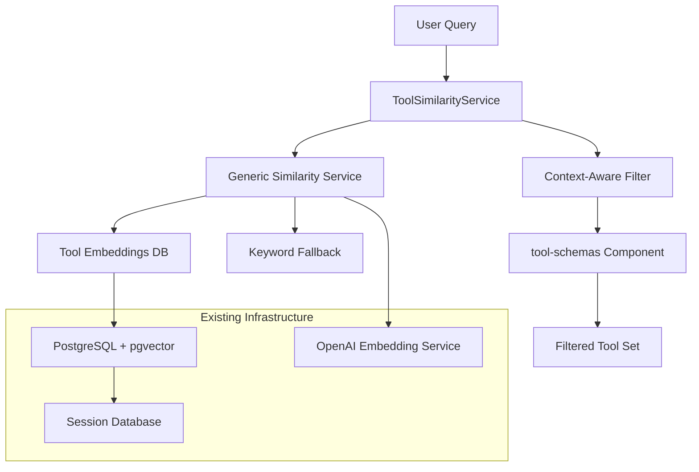

# Implementation Plan: Context-Aware Tool Management System

## Overview

This plan implements mt#256 using the proven embedding infrastructure and generic similarity service patterns established in mt#253 (tasks), mt#445 (rules), and mt#447 (generic service).

**PRIMARY GOAL**: Reduce context pollution in `minsky context generate` from 73% to <30% by implementing query-aware tool filtering.

## Architecture Design

### Core Components



### Service Architecture (Following Proven Patterns)

**1. ToolSimilarityService** (Primary Interface)

```typescript
interface ToolSimilarityService {
  findRelevantTools(request: ToolSearchRequest): Promise<RelevantTool[]>;
  indexToolEmbeddings(): Promise<void>;
  getToolMetadata(toolId: string): Promise<ToolMetadata>;
}

interface ToolSearchRequest {
  query: string;
  taskContext?: TaskContext;
  sessionContext?: SessionContext;
  limit?: number;
  threshold?: number;
  categories?: CommandCategory[];
}
```

**2. Generic Similarity Service Integration** (mt#447 Foundation)

```typescript
// Tool-specific adapter for generic similarity service
class ToolSimilarityAdapter implements SimilaritySearchAdapter<Tool> {
  extractContent(tool: Tool): string {
    return `${tool.description} ${tool.category} ${tool.parameters.join(" ")}`;
  }

  extractId(tool: Tool): string {
    return tool.id;
  }

  mapMetadata(tool: Tool): Record<string, any> {
    return {
      category: tool.category,
      description: tool.description,
      parameters: tool.parameters,
    };
  }
}
```

**3. Database Schema** (Following mt#253/mt#445 Patterns)

```sql
CREATE TABLE tool_embeddings (
  id TEXT PRIMARY KEY,                    -- UUID
  tool_id TEXT NOT NULL,                 -- Command ID (e.g., "tasks.list")
  category TEXT NOT NULL,                -- CommandCategory enum
  dimension INT NOT NULL,                -- 1536 for OpenAI
  embedding vector(dimension),           -- pgvector embedding
  metadata JSONB,                        -- Tool metadata
  created_at TIMESTAMPTZ DEFAULT NOW(),
  updated_at TIMESTAMPTZ DEFAULT NOW(),
  last_indexed_at TIMESTAMPTZ
);

-- Indexes for similarity search (following mt#253 patterns)
CREATE INDEX idx_tool_embeddings_hnsw ON tool_embeddings
  USING hnsw (embedding vector_cosine_ops);

CREATE INDEX idx_tool_embeddings_category ON tool_embeddings (category);
CREATE INDEX idx_tool_embeddings_tool_id ON tool_embeddings (tool_id);
```

## Implementation Phases

### Phase 1: Tool Embeddings Infrastructure (Week 1)

**Goal**: Create embeddings for all tools using proven patterns

**Tasks**:

1. **Database Schema Setup**

   ```typescript
   // src/adapters/database/schemas/tool-embeddings.ts
   export const toolEmbeddingsSchema = pgTable("tool_embeddings", {
     id: text("id").primaryKey(),
     toolId: text("tool_id").notNull(),
     category: text("category").notNull(),
     dimension: integer("dimension").notNull(),
     embedding: vector("embedding"),
     metadata: jsonb("metadata"),
     createdAt: timestamp("created_at").defaultNow(),
     updatedAt: timestamp("updated_at").defaultNow(),
     lastIndexedAt: timestamp("last_indexed_at"),
   });
   ```

2. **Tool Embedding Service** (Reusing mt#445 Patterns)

   ```typescript
   // src/domain/tools/embeddings/tool-embedding-service.ts
   export class ToolEmbeddingService {
     constructor(
       private embeddingService: OpenAIEmbeddingService, // Reuse from mt#445
       private vectorStorage: PostgresVectorStorage, // Reuse from mt#253
       private commandRegistry: SharedCommandRegistry
     ) {}

     async indexAllTools(): Promise<void> {
       const allCommands = this.commandRegistry.getAllCommands();
       await this.indexTools(allCommands);
     }

     async indexTools(tools: Tool[]): Promise<void> {
       // Follow exact patterns from RulesEmbeddingService (mt#445)
       const batches = chunk(tools, 10); // Batch processing

       for (const batch of batches) {
         const contents = batch.map((tool) => this.extractToolContent(tool));
         const embeddings = await this.embeddingService.generateEmbeddings(contents);

         for (let i = 0; i < batch.length; i++) {
           await this.vectorStorage.store(
             batch[i].id,
             embeddings[i],
             this.createToolMetadata(batch[i])
           );
         }
       }
     }

     private extractToolContent(tool: Tool): string {
       return `${tool.name} ${tool.description} ${tool.category} ${Object.keys(tool.parameters).join(" ")}`;
     }
   }
   ```

3. **CLI Command for Indexing** (Following mt#445 Pattern)
   ```typescript
   // Add to existing tools commands
   minsky tools index-embeddings [--tool <tool-id>]
   ```

### Phase 2: Generic Similarity Service Integration (Week 2)

**Goal**: Implement ToolSimilarityService using mt#447 foundation

**Tasks**:

1. **Tool Similarity Service Implementation**

   ```typescript
   // src/domain/tools/similarity/tool-similarity-service.ts
   export class ToolSimilarityService {
     constructor(
       private genericSimilarityService: GenericSimilarityService, // mt#447
       private toolAdapter: ToolSimilarityAdapter
     ) {}

     async findRelevantTools(request: ToolSearchRequest): Promise<RelevantTool[]> {
       // Use generic similarity service with tool-specific adapter
       const results = await this.genericSimilarityService.search({
         query: request.query,
         domain: "tools",
         adapter: this.toolAdapter,
         limit: request.limit || 20,
         threshold: request.threshold || 0.3,
         filters: {
           category: request.categories,
         },
       });

       return results.map((result) => ({
         toolId: result.id,
         relevanceScore: result.score,
         tool: this.getToolFromRegistry(result.id),
         reason: result.reason,
       }));
     }
   }
   ```

2. **Fallback Mechanisms** (Following mt#447 Pattern)

   ```typescript
   // Implement keyword and category-based fallbacks
   class ToolKeywordFallback implements SimilaritySearchBackend {
     async search(query: string, options: SearchOptions): Promise<SearchResult[]> {
       // Parse query for tool-related keywords
       const keywords = this.extractToolKeywords(query);
       const categories = this.mapKeywordsToCategories(keywords);

       return this.getToolsByCategories(categories, options.limit);
     }

     private extractToolKeywords(query: string): string[] {
       const toolKeywords = {
         debug: ["git", "test", "debug"],
         review: ["git", "diff", "code"],
         implement: ["tasks", "file", "edit"],
         test: ["test", "coverage", "run"],
         deploy: ["deploy", "config", "env"],
       };

       return Object.entries(toolKeywords)
         .filter(([intent]) => query.toLowerCase().includes(intent))
         .flatMap(([, keywords]) => keywords);
     }
   }
   ```

### Phase 3: Context Generation Integration (Week 3)

**Goal**: Modify tool-schemas component for query-aware filtering

**Tasks**:

1. **Enhanced Tool-Schemas Component**

   ```typescript
   // src/domain/context/components/tool-schemas.ts
   export const ToolSchemasComponent: ContextComponent = {
     async gatherInputs(context: ComponentInput): Promise<ComponentInputs> {
       // NEW: Query-aware tool filtering
       if (context.userQuery || context.userPrompt) {
         const toolSimilarityService =
           container.resolve<ToolSimilarityService>("ToolSimilarityService");

         const relevantTools = await toolSimilarityService.findRelevantTools({
           query: context.userQuery || context.userPrompt,
           taskContext: context.task,
           sessionContext: context.session,
           limit: 20, // Configurable limit
           threshold: 0.3, // Configurable threshold
         });

         // Build tool schemas for relevant tools only
         const toolSchemas = {};
         for (const relevantTool of relevantTools) {
           const { properties, required } = extractParameterSchemas(relevantTool.tool.id);
           toolSchemas[relevantTool.tool.id] = {
             description: relevantTool.tool.description,
             relevanceScore: relevantTool.relevanceScore,
             parameters: {
               type: "object",
               properties,
               required,
             },
           };
         }

         return {
           toolSchemas,
           totalTools: relevantTools.length,
           filteredBy: "user-query",
           originalToolCount: this.getAllToolsCount(),
           reductionPercentage: this.calculateReduction(relevantTools.length),
           queryUsed: context.userQuery || context.userPrompt,
         };
       }

       // Fallback to existing logic for backward compatibility
       return this.generateAllTools(context);
     },

     render(inputs: ComponentInputs, context: ComponentInput): ComponentOutput {
       if (inputs.filteredBy === "user-query") {
         return {
           content: this.renderFilteredTools(inputs),
           metadata: {
             tokenCount: this.estimateTokenCount(inputs.toolSchemas),
             toolCount: inputs.totalTools,
             filteredBy: inputs.filteredBy,
             reductionAchieved: inputs.reductionPercentage,
           },
         };
       }

       return this.renderAllTools(inputs);
     },
   };
   ```

2. **Configuration Support**
   ```typescript
   // Add to context generation configuration
   interface ContextGenerationConfig {
     toolFiltering: {
       enabled: boolean;
       maxTools: number;
       similarityThreshold: number;
       fallbackToAll: boolean;
     };
   }
   ```

### Phase 4: Testing and Optimization (Week 4)

**Goal**: Validate implementation and optimize performance

**Tasks**:

1. **Comprehensive Testing**

   ```typescript
   // Test various user query scenarios
   const testCases = [
     {
       query: "help me debug a failing test",
       expectedCategories: ["TASKS", "GIT", "DEBUG"],
       expectedTools: ["tasks.list", "git.bisect", "debug.analyze"],
     },
     {
       query: "review this pull request",
       expectedCategories: ["GIT", "TASKS"],
       expectedTools: ["git.diff", "git.log", "tasks.get"],
     },
     {
       query: "implement user authentication",
       expectedCategories: ["TASKS", "CONFIG", "SESSION"],
       expectedTools: ["tasks.create", "config.set", "session.start"],
     },
   ];
   ```

2. **Performance Benchmarking**

   ```bash
   # Before optimization
   minsky context generate --analyze-only
   # Expected: 21,853 tokens (15,946 from tool-schemas)

   # After optimization with query
   minsky context generate --prompt "debug test failure" --analyze-only
   # Target: ~11,000 tokens (5,000 from tool-schemas)
   # Improvement: 50% context reduction, 10,000+ tokens freed
   ```

3. **Validation Scripts**

   ```typescript
   // Automated validation of token reduction and relevance
   export async function validateContextOptimization() {
     const queries = [
       "debug failing test",
       "review pull request",
       "implement authentication",
       "deploy application",
       "analyze performance",
     ];

     for (const query of queries) {
       const originalContext = await generateContext({ query: null });
       const optimizedContext = await generateContext({ query });

       const tokenReduction = calculateReduction(originalContext, optimizedContext);
       const relevanceScore = await assessToolRelevance(query, optimizedContext.tools);

       console.log(`Query: ${query}`);
       console.log(`Token Reduction: ${tokenReduction}%`);
       console.log(`Relevance Score: ${relevanceScore}%`);
     }
   }
   ```

## Integration Patterns

### Following Proven Infrastructure

**1. Database Patterns** (mt#253 + mt#445)

- Reuse session database connection
- Follow identical table structure patterns
- Use same pgvector indexing strategies
- Implement same migration patterns

**2. Embedding Patterns** (mt#445)

- Reuse OpenAIEmbeddingService
- Follow same batch processing logic
- Use identical error handling
- Implement same progress reporting

**3. Similarity Service Patterns** (mt#447)

- Use generic similarity service foundation
- Implement tool-specific adapter
- Configure fallback chain
- Follow same configuration patterns

### Configuration Integration

```toml
# Add to existing config
[tools]
  [tools.embeddings]
  enabled = true
  provider = "openai"
  model = "text-embedding-3-small"
  batchSize = 10

  [tools.similarity]
  defaultThreshold = 0.3
  maxResults = 20
  fallbackChain = ["embeddings", "keyword", "category"]

  [tools.contextGeneration]
  enableFiltering = true
  maxToolsWithQuery = 20
  maxToolsWithoutQuery = 50
  tokenBudget = 8000
```

## Success Metrics & Validation

### Quantitative Targets

| Metric                  | Baseline | Target  | Validation Method   |
| ----------------------- | -------- | ------- | ------------------- |
| Tool Schema Tokens      | 15,946   | <5,000  | Context analysis    |
| Total Context Tokens    | 21,853   | <11,000 | Context analysis    |
| Tool Count (with query) | 50+      | 15-20   | Tool counting       |
| Relevance Accuracy      | ~30%     | >90%    | Manual review       |
| Response Time           | N/A      | <500ms  | Performance testing |

### Qualitative Validation

1. **Relevance Testing**: Manual review of tool selections for various queries
2. **User Experience**: Test context generation with real usage scenarios
3. **Backward Compatibility**: Ensure existing workflows continue working
4. **Performance**: Validate no degradation in context generation speed

### Monitoring & Analytics

```typescript
// Tool usage analytics
interface ToolUsageMetrics {
  queryType: string;
  toolsIncluded: string[];
  toolsExcluded: string[];
  relevanceScores: number[];
  tokenReduction: number;
  userSatisfaction?: number;
}

// Implement monitoring in tool-schemas component
export function trackToolUsage(metrics: ToolUsageMetrics) {
  // Log to analytics system for continuous improvement
}
```

## Risk Mitigation

### Technical Risks

1. **Embedding Performance**: Use proven patterns from mt#253/445
2. **Relevance Accuracy**: Implement robust fallback mechanisms
3. **Integration Complexity**: Build incrementally on existing infrastructure
4. **Database Performance**: Use same optimized queries and indexes

### Delivery Risks

1. **Infrastructure Dependencies**: All required components are available
2. **Testing Scope**: Use existing test patterns and validation methods
3. **Performance Impact**: Monitor and optimize using proven techniques

## Conclusion

This implementation plan leverages the proven embedding infrastructure and follows established patterns from mt#253 (tasks) and mt#445 (rules), ensuring:

- **Rapid Development**: Reuse of proven components and patterns
- **High Quality**: Following successful implementation patterns
- **Low Risk**: Building on stable, tested infrastructure
- **Immediate Impact**: Direct solution to critical context pollution problem

**Timeline**: 4 weeks to full implementation with immediate 50%+ context reduction for users of `minsky context generate` with query parameters.
