

Fractal Weekly Demo Party #2

# What Is Minsky?

I built it for a year and still can't say.

Eugene Dobry · @pee_zombie · AI coding orchestration

<!--
I'm Eugene. I've been building this thing called Minsky for about a year — roughly, an orchestration system for AI coding work. This is less a demo than a discussion. I'm not going to pitch you; I want your reaction. Last week I showed you one piece of it actually working. Today I want to zoom out — and admit I can't yet explain the whole thing. Come argue with me after all the talks.
-->

---

Origin, in one breath

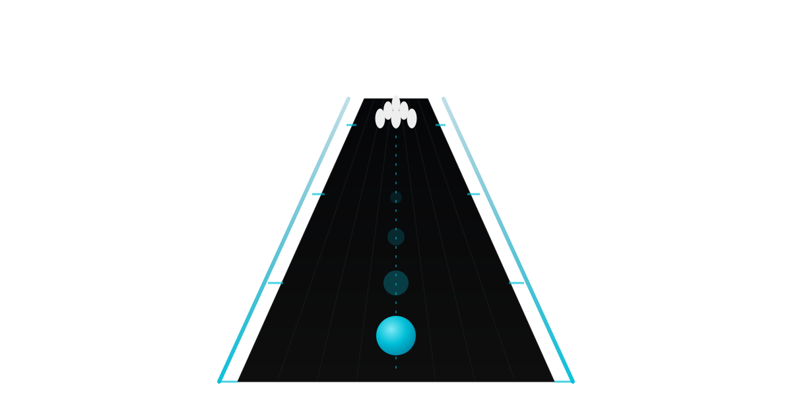

Don't instruct the agent. Build the lane.

<!--
I left my job last year, took a sabbatical, and went all-in on AI coding to understand what this stuff actually is. I started building tooling for myself — session isolation, a memory system, hooks. It kept growing. Here's the thing I noticed: these agents are brilliant programmers and weirdly myopic at the same time — not self-aware — in a way that reminded me of managing my own ADHD. So instead of trying to instruct the agent into behaving, I started building the environment around it. Bumpers, not lectures. And I stayed heads-down on that for months.
-->

---

What it actually is

It runs under your coding agent. The substrate lives underneath.

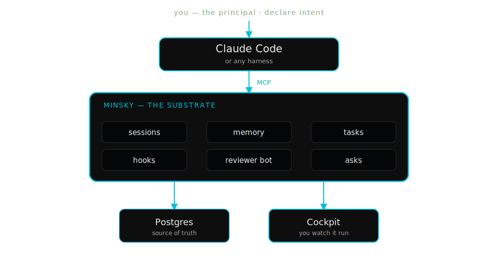

<!--
Concretely, here's the shape — so the rest of the talk isn't abstract. You work in your coding agent: Claude Code, or whatever harness you use. Minsky sits underneath it, over MCP. And underneath THAT is a real system — sessions, a memory that persists across them, a task lifecycle, hooks that fire automatically to catch mistakes, an adversarial reviewer bot, an escalation channel called asks — all backed by Postgres. It's not an app you open instead of your agent. It's the substrate your agent runs inside.
-->

---

…and you watch it run

The cockpit — mission control for the flock.

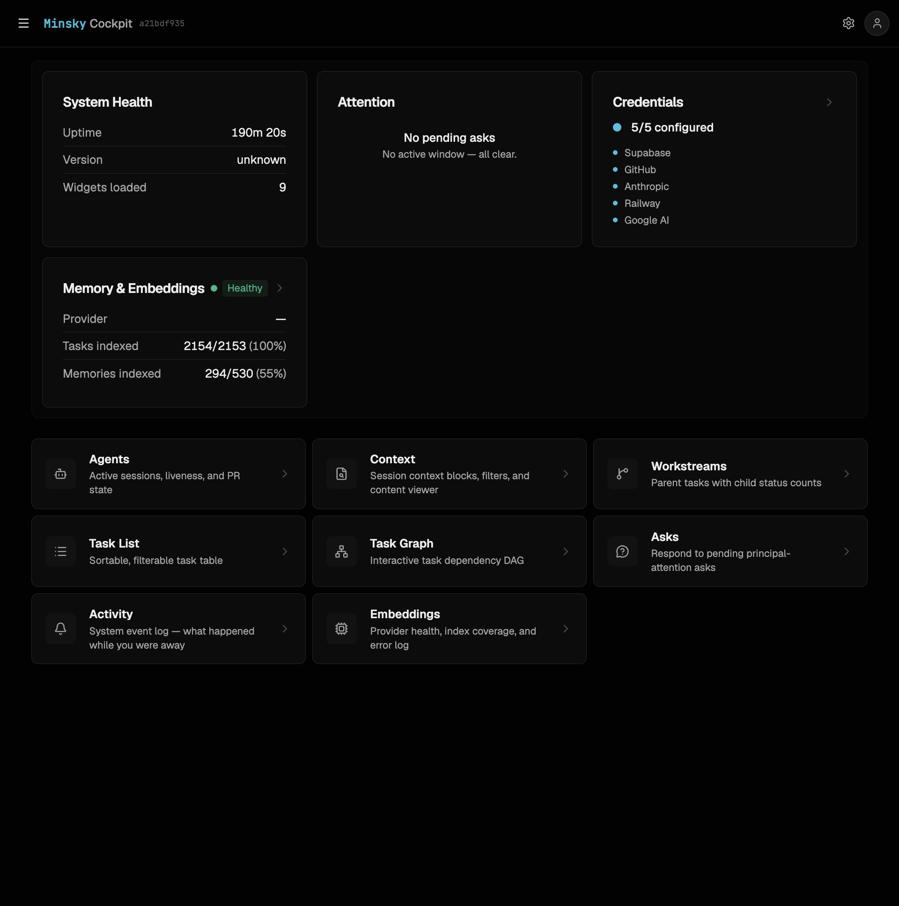

<!--
And here's the part you actually look at — the cockpit. A web UI over the whole substrate: system health, what's waiting on your attention, which credentials are wired, memory and embedding coverage, and a grid for agents, tasks, sessions, the dependency graph, asks. This is the "mission control you fly" — not a dashboard you read after the fact, but the surface you watch the flock run in. Last week I showed one piece of this actually working; today it's the backdrop.
-->

---

In practice

You work in your agent. It's calling Minsky the whole time.

  
claude code — task/mt-2272

  

›implement mt#2272

→ minsky.tasks_get  spec · scope · acceptance tests

→ minsky.session_start  isolated workspace

→ minsky.memory_search  12 prior decisions → context

  … editing 4 files …

⨯ hook  edit blocked: generated file  edit the source

→ minsky.session_commit  pre-commit guards pass

→ minsky.session_pr_create  reviewer bot dispatched

↺ /retrospective  recurrence check  5 prior, same root

  

<!--
This is what it looks like from the inside — and it's the clearest answer to "what is it." You're just working in Claude Code. But every step, it's calling Minsky underneath: pull the task spec, start an isolated session, search memory and inject the prior decisions, edit — and a hook fires to block an edit to a generated file before it happens, commit through the pre-commit guards, open the PR and dispatch the reviewer bot, and when I slip into a known failure pattern, a retrospective runs a recurrence check across everything that came before. None of that is me remembering to do it. The substrate does it. That's the lane.
-->

---

The crisis

Then I looked up — and the field had filled in.

<!--
Then a few months ago I looked up. The models had gotten dramatically better, and a dozen teams had shipped things that look a lot like Minsky. And I realized I'd lost the plot on what actually makes Minsky Minsky. So I did the obvious thing — I taught the agent to do competitive and semiotic-branding analysis, and mapped the whole landscape.
-->

---

The field

Everyone agrees code is no longer the bottleneck. The fight is over what the bottleneck is — and where you put the intelligence to handle it.

  <a class="comp-card" href="https://conductor.build" target="_blank" rel="noopener">
    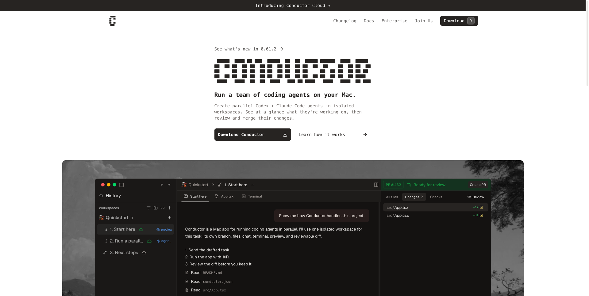
    Conductor conductor.build
    "you are the conductor"
    Mac app · terminal-light indie
  </a>

  <a class="comp-card" href="https://multica.ai" target="_blank" rel="noopener">
    
    Multica multica.ai
    "your next 10 hires won't be human"
    substitution myth · serif/pastoral
  </a>

  <a class="comp-card" href="https://www.cortex.io" target="_blank" rel="noopener">
    
    Cortex cortex.io
    "Code is no longer the bottleneck. Everything else is."
    enterprise governance
  </a>

  <a class="comp-card" href="https://smithers.sh" target="_blank" rel="noopener">
    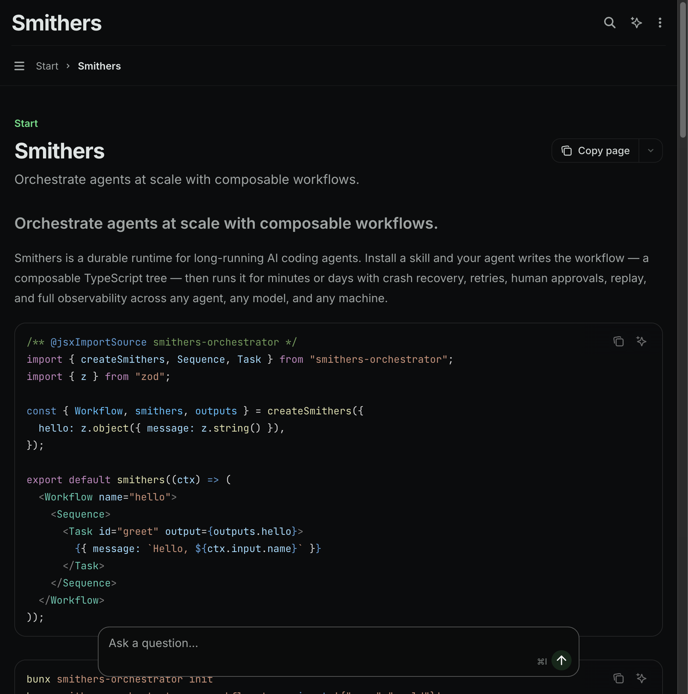
    

      Smithers
      durable TS workflow runtime
    

  </a>

  <a class="comp-card" href="https://t3.codes" target="_blank" rel="noopener">
    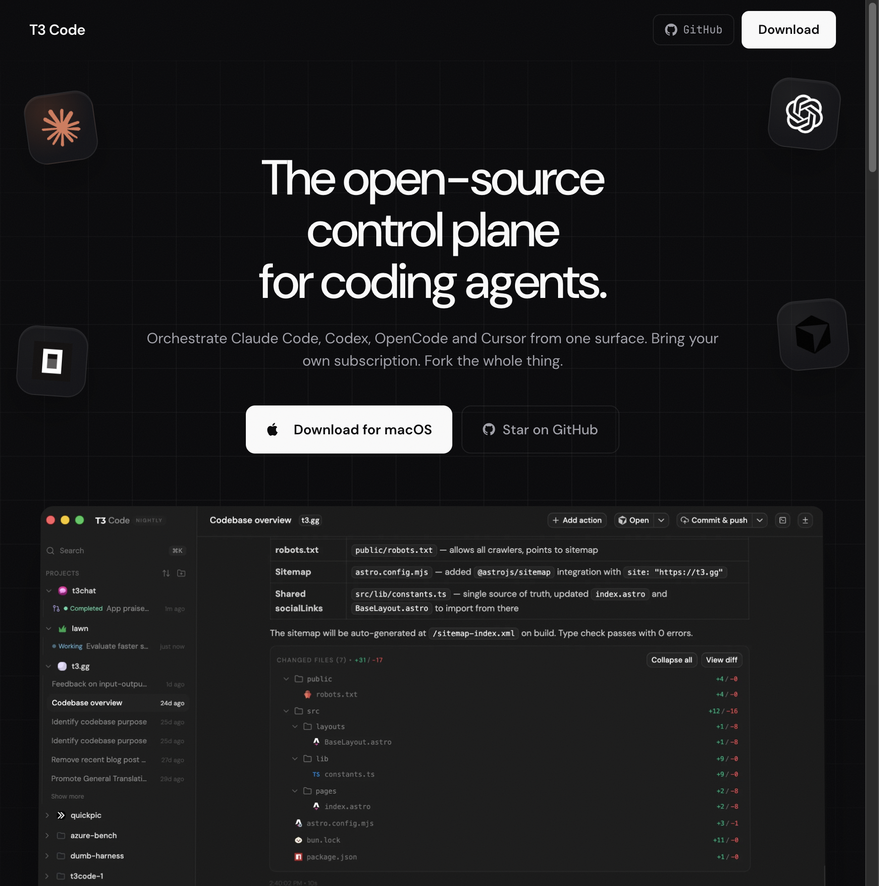
    

      T3 Code
      open-source control plane
    

  </a>

  <a class="comp-card" href="https://macro.com" target="_blank" rel="noopener">
    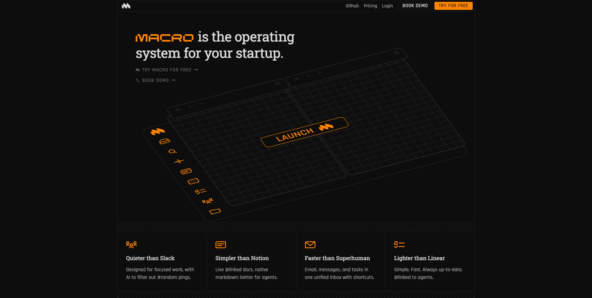
    

      Macro
      "operating system for your startup"
    

  </a>

<!--
Here's the field. Conductor: you are the conductor. Multica: your next 10 hires won't be human. Cortex: code is no longer the bottleneck, everything else is. Smithers, T3 Code, Macro down here. A dozen serious teams, shipping fast. When I first saw this wall, my stomach dropped — because at a glance, they look like me.
-->

---

Same parts

## Features don't separate us.

  orchestrate agents
  worktree isolation
  bring your own model
  skills layer
  review gate

Everyone has the parts. What differs is the bet — what the system is for.

<!--
But when I actually mapped them, the panic faded. Because they all have the same parts. Orchestrate multiple agents, isolate each in a git worktree, bring your own model, a skills layer, a human review gate. That's the whole checklist, and everyone ships it. So features can't be the answer to "what is Minsky" — we'd all give the same list. What actually separates these products is the bet underneath: what unit the system serves, and where the intelligence lives. That's the only axis that matters — and it's a question about myth, not features.
-->

---

My best current answer

The field built apps for driving agents. Minsky is the substrate the agents — and you — live inside.

Conductor says you are the conductor. Minsky says the orchestra should conduct itself — so you're free to think.

  exocortex·cyberbrain·the substrate

<!--
Here's where I've landed. Everyone else built an app you sit in front of to drive your agents. I think Minsky is the thing you and the agents live inside — an exocortex. A substrate that holds the same way whether you're a solo dev or a whole org. That's my best current answer. My actual problem: Cortex says their whole thing in one line on a homepage, and I can't do that yet. The thesis is real; the one-liner isn't. That's what I'm stuck on.
-->

---

The part I'm surest of

## Same substrate, every rung.

  
solo devone principal, a flock of agents

  
tech leada principal over a team of those

  
the orga principal over teams of teams

Everyone else picked one rung. Minsky is the same substrate at every rung — because being a principal is recursive.

<!--
One more, if the clock allows — the part I'm most sure is right and least able to say fast. Every competitor picked a rung: you're a solo dev, or a team, or an org, and the product is built for that one. Minsky is the same substrate at every rung, because being a principal is recursive. The solo dev directing a flock of agents is a principal. The lead directing a team of those is a principal. The VP over teams of teams is a principal. Same shape, all the way up. Nobody else is built that way — and I still can't compress it into a sentence.
-->

---

The ask

If you had to explain Minsky in one sentence — what would you say?

Can't yet? Even better for me — tell me where I lost you, or what you'd want to see. The confusion is the data I'm after. Come find me after; I'll be around.

Eugene Dobry · @pee_zombie

<!--
So that's my ask, and it's a real one. If you can say Minsky in one sentence — tell me, because I can't. But if you can't either — that's actually more useful to me. Tell me where I lost you, what confused you, what you'd have wanted to see. I'm trying to make this thing legible, and the gap between what I said and what landed is exactly the data I need. Come find me after — I'll be around. Thanks.
-->

---

Minsky

## The cyberbrain for software organizations

Repo
github.com/edobry/minsky

These slides
edobry.github.io/minsky/what-is-minsky

Last week
…/when-the-agent-is-wrong

Missed last week? It's the piece I mentioned — grab it. Then come argue with me about the one-liner.

Eugene Dobry · @pee_zombie

<!--
Resources slide: repo and slides as QR + text, plus the contact handle. The slides URL is live once this deck merges to main and the deploy-talks Pages workflow runs. Kept separate from the "one sentence?" ask so that rhetorical closer lands clean.
-->

---

Appendix · if there's time or a question

More of the cockpit — one surface, the whole substrate.

  <figure>
    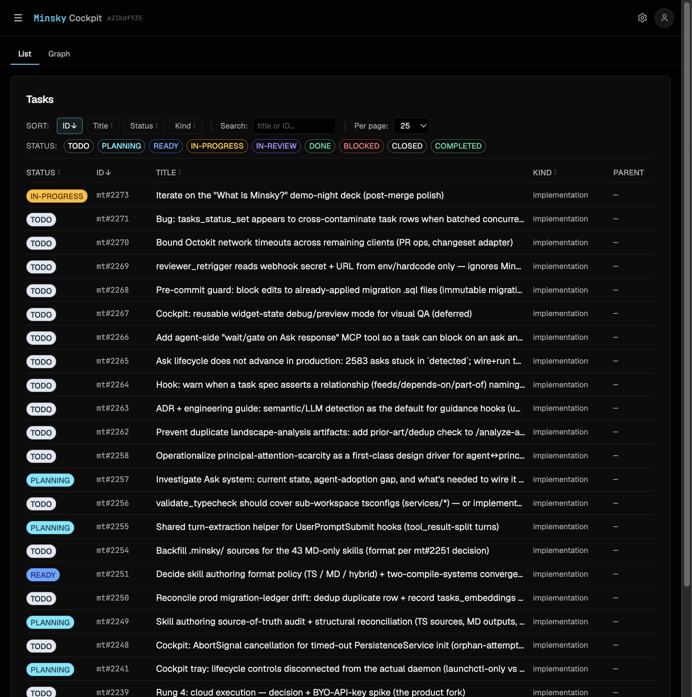
    <figcaption><b>Task list</b> — every task, its status and lifecycle</figcaption>
  </figure>
  <figure>
    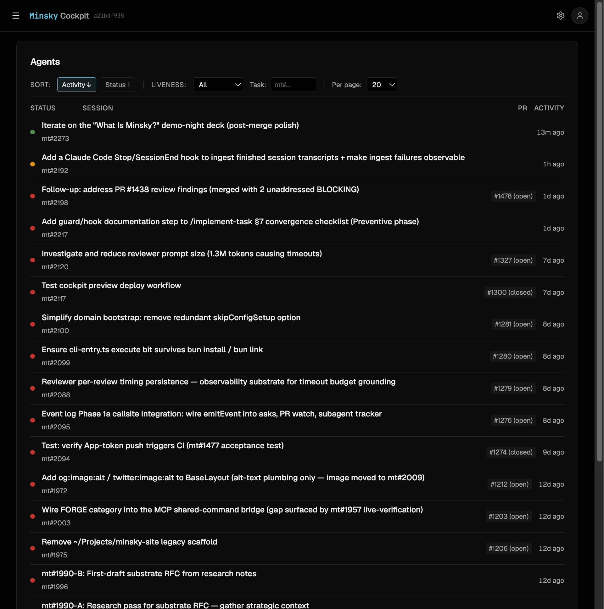
    <figcaption><b>Agents</b> — live sessions, liveness, PR state</figcaption>
  </figure>
  <figure>
    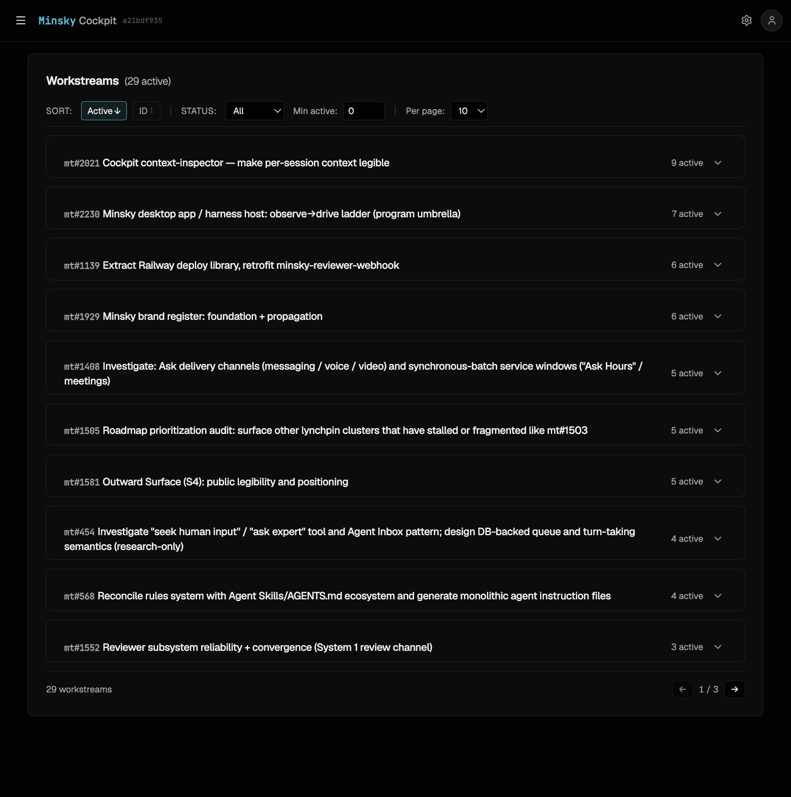
    <figcaption><b>Workstreams</b> — parent tasks, active child counts</figcaption>
  </figure>
  <figure>
    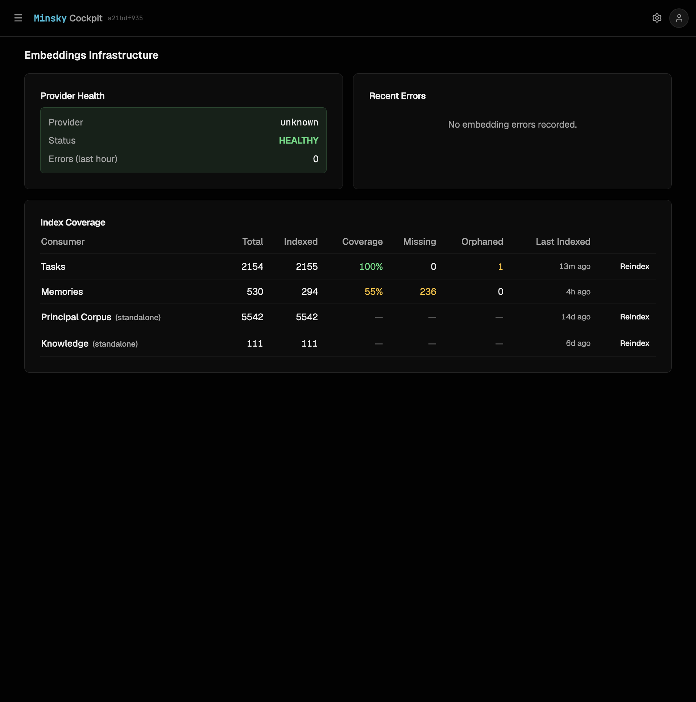
    <figcaption><b>Memory & embeddings</b> — coverage across the corpus</figcaption>
  </figure>

<!--
Backup slide — not part of the 3-minute run; here to jump to if someone after the talk asks "what else is in it" or "show me the cockpit." Four more surfaces: the task list (every task and its lifecycle), agents (live sessions with liveness and PR state), workstreams (parent tasks with their active children — the flock view), and the embeddings/memory coverage across tasks, memories, and the principal corpus. One surface over the whole substrate.
-->
